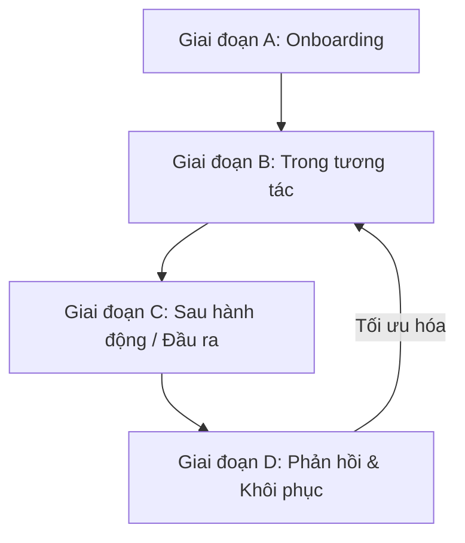

# BÁO CÁO THIẾT KẾ TRẢI NGHIỆM AI (HUMAN-CENTERED AI DESIGN REPORT)
**Môn học:** Human-Centered AI Design — Ngày 18 (Khoá 02)
**Nhóm:** N01 - Day18
**Thành viên nhóm:**
1. Nguyễn Ngọc Duy - 2A202600980
2. Nguyễn Huy Bảo - 2A202600998
3. Trần Ngọc Thủy - 2A202600799
**Chủ đề:** AI Gợi ý hành trang theo thời tiết và hoạt động (Smart Packing & Prep)
**Track áp dụng:** AI Travel Planner

---

## 1. TỔNG QUAN PHẠM VI & LÁT CẮT TÍNH NĂNG (FEATURE SLICE)
*   **Vấn đề của người dùng:** Chuẩn bị hành lý đi du lịch luôn là nỗi lo lắng (lo thiếu đồ dùng cần thiết, mang thừa gây cồng kềnh, vi phạm quy định bay, hoặc đồ không hợp thời tiết).
*   **Lát cắt tính năng thiết kế:** **Smart Packing & Prep** – Hệ thống AI đọc lịch trình du lịch, phân tích dự báo thời tiết tại điểm đến theo thời gian thực và đặc điểm của các hoạt động để tự động cá nhân hóa danh sách chuẩn bị (checklist) hành trang.
*   **Nguyên tắc cốt lõi:** Đảm bảo người dùng hiểu rõ dữ liệu AI sử dụng, giữ toàn quyền kiểm soát danh sách (không tự ý đặt mua/thanh toán), dễ dàng phát hiện sai sót và có đường khôi phục trải nghiệm mượt mà khi AI tính toán chưa chính xác.

---

## 2. VÒNG ĐỜI TRẢI NGHIỆM THỐNG NHẤT (EXPERIENCE LIFECYCLE)

*   **Onboarding:** Thiết lập kỳ vọng về những gì AI hỗ trợ (check thời tiết, hoạt động) và ranh giới tự chủ (không tự động thanh toán, không lưu dữ liệu vĩnh viễn nếu chưa cho phép).
*   **Trong tương tác:** AI hỏi thêm bối cảnh (phương tiện di chuyển, phong cách hành lý) để thu hẹp khoảng không chắc chắn.
*   **Sau hành động:** Cung cấp Checklist đề xuất kèm "Lớp bằng chứng" (Explainability) giải thích lý do đề xuất từng món đồ.
*   **Phản hồi & Khôi phục:** Xử lý các tình huống thời tiết thay đổi đột ngột hoặc hành lý quá cân nặng xách tay của hãng bay.

---

## 3. CHI TIẾT 5 KỊCH BẢN TRẢI NGHIỆM (SCENARIO PACK)

### Kịch bản 1: First-Time User Onboarding (Bắt buộc - T0)
*   **Bối cảnh:** Người dùng lần đầu mở tính năng Smart Packing trong ứng dụng Travel Planner.
*   **Mô tả UI/Flow:** 
    *   Màn hình giới thiệu ngắn gọn bằng thẻ trực quan (Card), nêu rõ: *"Tôi có thể giúp bạn tạo checklist hành lý tự động dựa trên thời tiết thực tế và hoạt động trong tour của bạn."*
    *   Làm rõ giới hạn: *"Tôi sẽ không tự động đặt mua bất kỳ món đồ nào hoặc lưu thông tin sức khỏe của bạn khi chưa được cho phép."*
    *   Hỏi xin quyền truy cập: Định vị thời gian thực, đồng bộ lịch trình, và thông báo đẩy.
*   **Ranh giới tự chủ (Agency):** `Ask` (Hỏi và giải thích lý do cần quyền truy cập trước khi hoạt động).

### Kịch bản 2: AI hỏi thêm thông tin khi dữ liệu mơ hồ (Trong tương tác - T1)
*   **Bối cảnh:** Người dùng nhập yêu cầu: *"Tôi đi Đà Lạt từ 10-12/7. Hãy chuẩn bị hành lý cho tôi."*
*   **Mô tả UI/Flow:** 
    *   AI đang phân tích hiển thị tiến độ rõ ràng: *✓ Đã kiểm tra thời tiết, ✓ Đã đọc lịch trình*.
    *   AI chưa biết cách di chuyển lên đỉnh Langbiang (Trekking hay đi xe Jeep) và gu đóng gói đồ (Gọn nhẹ hay Đầy đủ).
    *   Hệ thống hiển thị câu hỏi lựa chọn nhanh (Quick Choices) dưới dạng tag để người dùng bấm chọn nhanh.
*   **Ranh giới tự chủ (Agency):** `Ask` (Hỏi trước để thu hẹp giả định quan trọng, tránh tạo checklist sai lệch gây phiền nhiễu).

### Kịch bản 3: AI tạo đề xuất Checklist kèm bằng chứng (Sau tương tác - T3)
*   **Bối cảnh:** AI trả về Checklist đề xuất chia làm 3 nhóm: *Vật dụng bắt buộc*, *Theo thời tiết*, *Theo hoạt động*.
*   **Mô tả UI/Flow:** 
    *   Bên cạnh món đồ "Giày có độ bám tốt", người dùng thấy nút hỏi *"Vì sao?"*. 
    *   Khi bấm vào, hiển thị lớp bằng chứng: *"Được đề xuất vì lịch trình của bạn có hoạt động đi bộ tại Langbiang và dự báo thời tiết ngày 11/7 có khả năng mưa 60%. Cập nhật lúc 09:30."*
*   **Ranh giới tự chủ (Agency):** `Act` (Tự động đề xuất checklist nháp) phối hợp `Explainability` (Cung cấp bằng chứng minh bạch).

### Kịch bản 4: Thời tiết thay đổi đột ngột (Sai sót & Khôi phục - T6)
*   **Bối cảnh:** 2 ngày trước chuyến leo núi Fansipan, dự báo thời tiết từ nắng ráo đột ngột giảm sâu xuống $8^\circ\text{C}$ và có mưa phùn.
*   **Mô tả UI/Flow:** 
    *   Biểu ngữ cảnh báo màu đỏ ở đầu trang chủ: *⚠️ Thời tiết Fansipan đã thay đổi đột ngột!*
    *   Nút bấm nổi bật: **[Cập nhật hành lý theo thời tiết mới]** và **[Giữ nguyên danh sách]**.
    *   Khi xác nhận, màn hình hiển thị bảng đối chiếu đồ cần loại bỏ (kem chống nắng, đồ mỏng) và đồ thêm mới (áo phao, túi sưởi, áo mưa) để người dùng duyệt nhanh.
*   **Ranh giới tự chủ (Agency):** `Ask` (Không tự động sửa đổi danh sách đã pack của người dùng mà cảnh báo và xin phép).

### Kịch bản 5: Hành trang vượt quá quy định bay (Sai sót & Khôi phục - T7)
*   **Bối cảnh:** Danh sách đề xuất cắm trại Đà Lạt nặng 12kg trong khi người dùng bay Vietjet Air hạng phổ thông chỉ được mang 7kg xách tay, đồng thời danh sách chứa dao đa năng (vật cấm xách tay).
*   **Mô tả UI/Flow:** 
    *   Thanh đo cân nặng hiển thị quá tải màu đỏ: `12kg / 7kg`.
    *   Gắn nhãn đỏ cảnh báo bên cạnh món đồ: *gậy leo núi, dao kéo đa năng* (`🚫 Cấm mang lên cabin xách tay`).
    *   Cung cấp nút khôi phục: **[Tối ưu hóa theo quy định bay]** (AI sẽ tự động lọc lều/túi ngủ sang danh sách "Thuê tại Đà Lạt") hoặc **[Mua thêm ký gửi]** (chuyển hướng mua thêm hành lý).
*   **Ranh giới tự chủ (Agency):** `Don't Act` (Không tự thanh toán mua thêm cân) + `Ask` (Gợi ý cách khắc phục thông qua dịch vụ thuê ngoài).

---

## 4. RANH GIỚI TỰ CHỦ CỦA AI (AGENCY DESIGN MATRIX)

| Mức độ tự chủ | Hành động của AI | Rationale (Lý do thiết kế) |
| :--- | :--- | :--- |
| **Act (Tự làm)** | 1. Phân tích thời tiết & lịch trình. 2. Phân loại nhóm hành lý. 3. Tạo checklist bản nháp. | Rủi ro thấp, người dùng dễ dàng kiểm tra, check/uncheck để xóa hoặc thêm đồ thủ công. |
| **Ask (Hỏi trước)** | 1. Yêu cầu cấp quyền truy cập thời tiết/lịch trình. 2. Hỏi thông tin bổ sung khi bối cảnh mơ hồ. 3. Đề xuất cập nhật lại hành lý khi thời tiết đổi đột ngột. 4. Xin phép ghi nhớ sở thích lâu dài. | Ảnh hưởng trực tiếp đến chất lượng gợi ý hoặc quyền riêng tư cá nhân của người dùng. Cần xác nhận để tránh làm phiền. |
| **Don't Act (Cấm)** | 1. Tự ý mua sắm các đồ dùng còn thiếu. 2. Tự thanh toán vé máy bay/hành lý mua thêm. 3. Lưu trữ thông tin nhạy cảm (sức khỏe, vị trí vĩnh viễn) mà chưa được đồng ý rõ ràng. | Rủi ro tài chính, pháp lý và bảo mật cực kỳ cao. Quyền giao dịch tiền bạc bắt buộc thuộc về con người. |

---

## 5. MA TRẬN PHẢN HỒI HAI CHIỀU (TWO-WAY FEEDBACK 2X2)

| Chiều tương tác | Explicit (Tường minh) | Implicit (Ngầm định) |
| :--- | :--- | :--- |
| **User $\rightarrow$ System** | - Người dùng bấm nút "Báo cáo thông tin thời tiết sai". - Check chọn "Đã có" hoặc "Không cần mang" trên từng dòng vật dụng. - Chọn lý do loại bỏ món đồ (ví dụ: *"Tôi sẽ đi xe Jeep nên không cần giày trekking"*). | - Người dùng giữ lại trang phục ấm dù thời tiết báo nắng nóng (hệ thống ghi nhận xu hướng chịu lạnh kém để đề xuất sau này). - Người dùng tắt thông báo đề xuất mua sắm (hệ thống hạn chế hiển thị link mua hàng ngoài). |
| **System $\rightarrow$ User** | - Biểu ngữ thông báo thời tiết thay đổi đột ngột. - Thẻ giải thích lý do đề xuất (Explainability). - Nhãn cảnh báo cấm xách tay `🚫 Cấm mang lên cabin` của hãng hàng không. | - Thanh đo cân nặng tự động chuyển sang màu Đỏ khi quá tải. - Thứ tự ưu tiên: Đồ bắt buộc đặt ở đầu, đồ nghi ngờ có icon cảnh báo màu vàng. - Nút [Hoàn tác] hiển thị nổi bật dạng lơ lửng (floating button) sau khi người dùng thực hiện thay đổi danh sách. |

---

## 6. LỚP BẰNG CHỨNG & EXPLAINABILITY
*   **Cơ chế hoạt động:** Hệ thống không chỉ đưa ra danh sách đồ dùng áp đặt mà luôn đi kèm một biểu tượng thông tin `(i)` bên cạnh mỗi vật phẩm AI tự động đề xuất.
*   **Trực quan hóa:** Khi bấm vào biểu tượng, hệ thống mở ra một cửa sổ nhỏ (tooltip) hiển thị rõ:
    1.  **Dữ liệu đầu vào (Data):** Nhiệt độ thực tế tại địa điểm, độ ẩm, khả năng mưa, thời gian di chuyển.
    2.  **Logic suy luận (Reasoning):** Thời gian đi bộ dài + mưa $\rightarrow$ Cần giày chống trượt và áo mưa.
    3.  **Thời gian cập nhật (Timestamp):** *"Dữ liệu được cập nhật từ AccuWeather cách đây 15 phút"*, giúp người dùng tin tưởng đúng mức vào mức độ cập nhật của thông tin.

---

## 7. KỊCH BẢN DEMO THUYẾT TRÌNH (DEMO PATH - 5 PHÚT)

*   **0:00 - 0:30 (Mở đầu):** Giới thiệu nhóm, đề tài "Smart Packing & Prep" và lát cắt tính năng gợi ý hành lý theo thời tiết/hoạt động.
*   **0:30 - 1:15 (Onboarding):** Trình diễn màn hình Onboarding đầu tiên. Cho thấy cách thiết lập kỳ vọng đúng cho người dùng, xin quyền định vị/thời tiết và giới hạn tự chủ của AI.
*   **1:15 - 2:15 (Luồng chính & Agency):** Demo cảnh người dùng nhập thông tin đi Đà Lạt. Trình diễn trạng thái AI hỏi thêm (Ask) về hình thức trekking/phương tiện. AI hiển thị Checklist đề xuất, bấm vào món "Giày bám đường" để xem lớp bằng chứng giải thích lý do.
*   **2:15 - 3:45 (Sai sót & Khôi phục):** 
    *   *Nhánh 1:* Nhập thời tiết Fansipan thay đổi đột ngột lạnh mưa. Show màn hình cảnh báo đỏ và cách người dùng bấm nút cập nhật để AI đổi nhanh danh sách đồ ấm.
    *   *Nhánh 2:* Show thanh cân nặng quá tải 12kg/7kg xách tay. Cảnh báo dao đa năng bị cấm. Bấm nút "Tối ưu hóa" để chuyển sang thuê lều trại tại Đà Lạt, đưa cân nặng về mức an toàn.
*   **3:45 - 4:45 (Vòng phản hồi):** Thao tác sửa đổi đồ trên checklist, chọn lý do loại bỏ món đồ, đồng ý/từ chối cho phép hệ thống ghi nhớ thói quen đi du lịch cho lần sau.
*   **4:45 - 5:00 (Kết luận):** Tóm tắt quyết định thiết kế quan trọng nhất (Không cho phép AI tự thanh toán giao dịch) và giải đáp câu hỏi của Ban giám khảo.
