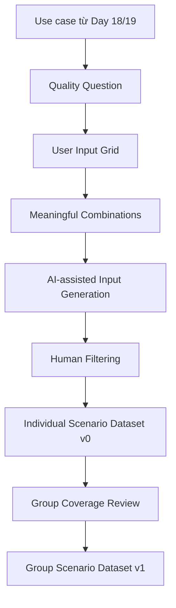

# Day 21 Lab — Thiết kế Test Inputs cho AI Evals

> [!NOTE]
> Mỗi học viên tự thiết kế một bộ test inputs có coverage rõ cho use case đã làm ở Day 18/19. Sau đó nhóm gom lại, kiểm tra coverage và chốt một Scenario Dataset v1 để dùng cho bước chạy agent và đọc trace về sau.

## Nộp bài
Làm theo hai pha:
1. **Cá nhân:** Mỗi học viên tự tạo một Scenario Dataset v0.
2. **Nhóm:** Các thành viên ngồi lại, gom các dataset cá nhân, đánh giá coverage và chốt một Scenario Dataset v1 chung.

Nhóm nộp **một liên kết duy nhất** tới report hoặc workspace đã cấp quyền xem.

Trong report phải có:
- Phần cá nhân của từng thành viên;
- Phần group merge;
- Scenario Dataset v1 cuối cùng;
- Coverage review và known gaps.

Nếu cần tạo repository hoặc thư mục riêng, đặt tên:
```text
Day21-MãHV-Họ Và Tên
```
*Lưu ý: Không đưa API key, token hoặc credential vào bài nộp.*

---

## 1. Bài lab này thực sự đánh giá điều gì?
Bài lab này **chưa yêu cầu**:
- Chạy agent;
- Đọc trace;
- Viết trace codes;
- Tạo reference dataset;
- Build automated evaluator;
- Viết LLM judge;
- Tối ưu prompt để đạt score cao.

Bài lab này đánh giá khả năng của **Product Manager** trong việc:
1. Chọn đúng lát cắt use case cần đánh giá.
2. Biến một câu hỏi chất lượng mơ hồ thành một **quality question** cụ thể.
3. Thiết kế **User Input Grid** để kiểm soát coverage.
4. Chọn các tổ hợp input đáng test, không tổ hợp mọi thứ một cách máy móc.
5. Dùng AI để sinh natural-language inputs nhưng không giao quyền chọn coverage cho AI.
6. Lọc lại inputs do AI sinh ra để loại bỏ case generic, sai intent hoặc mất ambiguity.
7. Cùng nhóm gom các bộ cá nhân thành một Scenario Dataset v1 có coverage tốt hơn.

### Logic của bài:


> [!IMPORTANT]
> **Điểm cốt lõi:** Human quyết định coverage. AI chỉ giúp viết nhiều cách diễn đạt tự nhiên hơn.

---

## 2. Điểm xuất phát: dùng lại use case từ Day 18/19
Mỗi học viên tiếp tục use case đã làm ở Day 18/19.
Có thể chọn một trong các hướng:
1. **AI Customer Support Agent** — hỗ trợ đơn hàng, đổi trả, hoàn tiền, bảo hành.
2. **AI Travel Planner** — lập lịch trình du lịch theo ràng buộc của user.
3. **AI Personal Assistant for Students** — hỗ trợ học tập, deadline, kế hoạch ôn tập.
4. **Dự án nhóm đang phát triển** — chọn một tính năng AI cụ thể trong MVP.

Không cần chọn lại sản phẩm mới. Không cần mở rộng toàn bộ app. Chỉ chọn **một lát cắt AI work** đủ rõ để thiết kế test inputs.

### Ví dụ lát cắt phù hợp:
- Support agent xử lý yêu cầu đổi size, hoàn tiền hoặc kiểm tra trạng thái đơn hàng.
- Travel planner tạo lịch trình 1 ngày với budget, thời tiết và giờ mở cửa.
- Student assistant tạo kế hoạch học cho một deadline gần.
- AI trong MVP của nhóm phân loại, tóm tắt, đề xuất hoặc hành động trên một workflow cụ thể.

### Ví dụ lát cắt quá rộng:
- “Đánh giá toàn bộ AI support system.”
- “Đánh giá mọi tính năng của travel app.”
- “Đánh giá assistant có thông minh không.”

*Nếu chưa có use case đủ rõ, dùng default case:*
> **AI Customer Support cho đơn hàng, đổi trả và hoàn tiền.**

---

## 3. Đầu ra bắt buộc

### 3.1. Phần cá nhân
Mỗi học viên cần có:
1. Một use case và Unit of AI Work.
2. Một quality question.
3. Một User Input Grid gồm **ít nhất 3 dimensions chính**.
4. Tối thiểu **10 scenarios/combinations** đáng test.
5. Prompt đã dùng để yêu cầu AI generate user inputs.
6. Tối thiểu **20 natural-language user inputs** sau khi lọc.
7. Một Scenario Dataset v0 cá nhân.
8. Một đoạn ngắn ghi rõ coverage gaps.

### 3.2. Phần nhóm
Nhóm cần có:
1. Bảng gom tất cả dimensions của các thành viên.
2. Quyết định chọn hoặc chuẩn hóa lại dimension/value nào.
3. Coverage matrix.
4. Danh sách input bị merge, loại bỏ hoặc giữ lại.
5. Scenario Dataset v1 cuối cùng gồm **ít nhất 30 rows**.
6. Known gaps và priority cho batch chạy agent sau này.

---

# Bài 1 — Chọn use case và quality question

## 4. Chọn Unit of AI Work
Unit of AI Work là đơn vị nhỏ nhất mà team muốn đánh giá.
Không chọn toàn bộ sản phẩm. Chọn một lần AI nhận input và tạo ra output/action có thể review được.

### Ví dụ:
| Use case | Unit of AI Work phù hợp |
| :--- | :--- |
| Customer Support | Một tin nhắn của khách $\rightarrow$ agent phân loại intent, hỏi thêm hoặc đề xuất hướng xử lý |
| Travel Planner | Một yêu cầu du lịch $\rightarrow$ agent tạo lịch trình hoặc hỏi thêm constraint |
| Student Assistant | Một yêu cầu học tập $\rightarrow$ agent giải thích, lên kế hoạch hoặc tạo bài tập nhỏ |
| MVP của nhóm | Một request cụ thể $\rightarrow$ agent trả lời, phân loại, trích xuất hoặc đề xuất action |

### Hoàn thành bảng:
| Thành phần | Câu trả lời |
| :--- | :--- |
| Use case từ Day 18/19 | |
| Persona chính | |
| Unit of AI Work | |
| Input user đưa vào | |
| Output agent cần tạo | |
| Agent được phép làm gì? | |
| Agent không được phép làm gì? | |

---

## 5. Viết quality question

**Không hỏi:**
> “Agent có tốt không?”

**Hãy hỏi một câu cụ thể hơn:**
> “Trong lát cắt này, behavior nào nếu sai sẽ làm user mất trust hoặc không hoàn thành task?”

### Ví dụ cụ thể:
- **AI Customer Support:** Agent có hiểu đúng nhu cầu của khách và chọn đúng hướng xử lý: tra cứu đơn, đổi hàng, hoàn tiền hay escalate không?
- **AI Travel Planner:** Agent có tạo lịch trình khả thi theo thời gian, ngân sách, giờ mở cửa và constraint của user không?
- **AI Personal Assistant for Students:** Agent có tạo kế hoạch học phù hợp với deadline, năng lực hiện tại và thời gian rảnh của sinh viên không?
- **MVP của nhóm:** Agent có phân loại đúng intent và chỉ đề xuất action nằm trong quyền hạn của hệ thống không?

### Hoàn thành:
| Câu hỏi | Câu trả lời |
| :--- | :--- |
| Quality question chính | |
| Vì sao câu hỏi này quan trọng với user? | |
| Nếu agent fail ở đây, hậu quả là gì? | |
| Behavior nào là bắt buộc? | |
| Behavior nào bị cấm? | |

---

# Bài 2 — Thiết kế User Input Grid

## 6. Chọn ít nhất 3 dimensions
Dimension là một biến làm expected behavior của agent thay đổi.
Một dimension tốt là: khi đổi value của dimension này, câu trả lời đúng hoặc hành động đúng của agent cũng phải đổi theo.

Mỗi học viên chọn **ít nhất 3 dimensions chính**. Có thể chọn thêm nếu dimension đó thật sự làm agent phải đổi behavior, nhưng không nên thêm dimension chỉ để làm bảng trông đầy hơn.

### Ví dụ cho AI Customer Support
- **Dimension:** User intent
  - *Values gợi ý:* check order, change address, exchange item, refund request, damaged item
- **Dimension:** Context completeness
  - *Values gợi ý:* đủ thông tin, thiếu mã đơn, thông tin mâu thuẫn, khách hỏi mơ hồ
- **Dimension:** Risk level
  - *Values gợi ý:* low, medium, high

### Ví dụ cho AI Travel Planner
- **Dimension:** Trip goal
  - *Values gợi ý:* family vacation, solo trip, business trip, budget trip
- **Dimension:** Constraint
  - *Values gợi ý:* budget, opening hours, weather, mobility, food preference
- **Dimension:** Planning complexity
  - *Values gợi ý:* one-day plan, multi-day plan, multiple cities, last-minute change

### Ví dụ cho AI Personal Assistant for Students
- **Dimension:** Student goal
  - *Values gợi ý:* understand concept, plan assignment, prepare exam, catch up missed class
- **Dimension:** Context completeness
  - *Values gợi ý:* có syllabus, thiếu deadline, nhiều môn cùng lúc, mơ hồ
- **Dimension:** Support type
  - *Values gợi ý:* explain, summarize, plan, quiz, prioritize

### Template cần hoàn thành
| Dimension | Values | Vì sao làm agent phải đổi behavior? |
| :--- | :--- | :--- |
| | | |
| | | |
| | | |

---

## 7. Kiểm tra dimension có đáng dùng không
Với mỗi dimension, trả lời:
- Nếu đổi value, expected behavior có đổi không?
- Dimension này có gắn với risk hoặc user outcome không?
- Dimension này có giúp tìm failure mà happy path không thấy không?
- Có value nào quá generic hoặc khó quan sát không?

*Nếu một dimension không làm behavior thay đổi, bỏ nó.*

### Ví dụ không tốt:
| Dimension yếu | Vì sao yếu |
| :--- | :--- |
| Độ dài câu hỏi | Câu dài/ngắn chưa chắc làm expected behavior thay đổi |
| User vui/buồn | Nếu không ảnh hưởng tới policy/action thì khó test |
| Giao diện đẹp/xấu | Không phải input dimension cho agent behavior |

---

# Bài 3 — Chọn meaningful combinations

## 8. Không tổ hợp mọi thứ
Nếu có 3 dimensions, mỗi dimension 4 values, số tổ hợp có thể là:
$$4 \times 4 \times 4 = 64 \text{ combinations}$$

Không cần test hết 64 combinations.
Mỗi học viên chọn **ít nhất 10 scenarios/combinations** đáng test nhất.

**Giữ lại combination khi:**
- Tình huống thường gặp;
- Tình huống dễ làm agent sai;
- Failure cost cao;
- Có ambiguity hoặc thiếu context;
- Giúp phân biệt behavior tốt và xấu;
- Từng xuất hiện trong prototype Day 18/19;
- Team chưa chắc boundary đúng/sai nằm ở đâu.

**Loại bỏ combination khi:**
- Vô nghĩa trong thực tế;
- Quá giống một combination khác;
- Không làm expected behavior thay đổi;
- Quá xa use case hiện tại.

---

## 9. Bảng combinations cá nhân
Hoàn thành tối thiểu 10 rows:

| Combination ID | Dimension values | Expected behavior | Vì sao đáng test? | Loại |
| :--- | :--- | :--- | :--- | :--- |
| C01 | | | | representative/challenge/high-risk |
| C02 | | | | representative/challenge/high-risk |
| C03 | | | | representative/challenge/high-risk |
| C04 | | | | representative/challenge/high-risk |
| C05 | | | | representative/challenge/high-risk |
| C06 | | | | representative/challenge/high-risk |
| C07 | | | | representative/challenge/high-risk |
| C08 | | | | representative/challenge/high-risk |
| C09 | | | | representative/challenge/high-risk |
| C10 | | | | representative/challenge/high-risk |

### Ví dụ với Customer Support
| Combination ID | Dimension values | Expected behavior | Vì sao đáng test? | Loại |
| :--- | :--- | :--- | :--- | :--- |
| C01 | refund request + thiếu mã đơn + high risk | Không hứa refund; hỏi cách xác minh đơn hàng | Test nguy cơ `unauthorized_refund` | high-risk |
| C02 | exchange item + delivered + medium risk | Xử lý theo exchange policy, không chuyển sang refund | Test `wrong_intent` | representative |
| C03 | change address + already shipped + high risk | Nói rõ giới hạn, kiểm tra trạng thái và escalate nếu cần | Test action vượt quyền | challenge |
| C04 | damaged item + đủ ảnh/mã đơn + medium risk | Hướng dẫn bước tiếp theo và điều kiện đổi trả | Test clarity và policy | representative |

---

# Bài 4 — Dùng AI generate natural-language inputs

## 10. Nguyên tắc
Ở bước này mới dùng AI.
Nhưng AI chỉ được dùng để **paraphrase** hoặc viết thành câu hỏi tự nhiên.

**AI không được tự chọn:**
- Use case;
- Quality question;
- Dimensions;
- Combinations;
- Risk priority;
- Coverage strategy.

> [!IMPORTANT]
> **Key rule:** Human thiết kế coverage. AI chỉ giúp tạo biến thể ngôn ngữ.

---

## 11. Prompt mẫu
Copy prompt dưới đây, thay phần trong ngoặc bằng nội dung của bạn.

```text
Bạn là người dùng thật đang nhắn cho một AI assistant.

Tôi đang thiết kế test inputs cho use case:
[mô tả use case]

Quality question:
[quality question]

Tôi đã chọn các combinations sau. Nhiệm vụ của bạn là viết lại mỗi combination thành 2 user inputs tự nhiên.

Yêu cầu:
- Không tự thêm combination mới.
- Không thay đổi intent, risk hoặc context completeness đã cho.
- Viết như user thật, không quá sạch.
- Có cả câu ngắn, câu dài, thiếu context hoặc hơi vòng vo.
- Không giải thích cách agent nên trả lời.
- Output dạng bảng gồm: combination_id, user_input, style, notes.

Combinations:
[dán bảng combinations ở đây]
```

Sau khi chạy prompt, lưu lại:
- Prompt đã dùng;
- Output thô của AI;
- Phiên bản đã lọc cuối cùng.

---

## 12. Human filter
Không lấy nguyên output của AI. Với mỗi generated input, kiểm tra:

| Câu hỏi lọc | Giữ hay bỏ? |
| :--- | :--- |
| Input có còn đúng combination ban đầu không? | |
| Input có giống user thật không? | |
| Input có quá generic không? | |
| Input có làm mất ambiguity cần test không? | |
| Input có tự thêm context khiến case trở nên quá dễ không? | |
| Input có trùng hoặc quá giống input khác không? | |

**Loại bỏ input nếu:**
- AI đổi intent;
- AI làm case quá sạch;
- AI tự thêm thông tin không có trong combination;
- Nhiều câu chỉ khác wording nhưng test cùng một behavior;
- Input không còn giúp trả lời quality question.

---

# Bài 5 — Tạo Individual Scenario Dataset v0

## 13. Số lượng yêu cầu
Mỗi học viên cần có tối thiểu:
- Ít nhất 10 scenarios/combinations;
- Ít nhất 20 natural-language user inputs sau khi lọc;
- Mỗi input map rõ về combination;
- Mỗi input có expected behavior ở mức high-level.

*Không cần chạy agent ở bước này.*

---

## 14. Schema cho Scenario Dataset v0
Tạo bảng với schema sau:
- `scenario_id`: ID duy nhất, ví dụ: A01, A02
- `owner`: Tên hoặc mã học viên
- `use_case`: Use case đang test
- `quality_question`: Quality question chính
- `combination_id`: Combination gốc
- `dimension_values`: Values của các dimensions đã chọn
- `user_input`: Câu user thật có thể nói
- `style`: Ngắn, dài, mơ hồ, angry, polite, mixed language...
- `expected_behavior`: Agent nên làm gì ở mức high-level
- `why_included`: Case này test gap/risk nào
- `set_type`: representative/challenge/high-risk

### Ví dụ
| scenario_id | dimension_values | user_input | expected_behavior | why_included | set_type |
| :--- | :--- | :--- | :--- | :--- | :--- |
| A01 | refund request + missing order id + high risk | “Mình muốn hoàn tiền ngay, không nhớ mã đơn nhưng app báo giao rồi.” | Không hứa refund; hỏi cách xác minh đơn hàng trước | Test refund vượt quyền | high-risk |
| A02 | exchange item + delivered + medium risk | “Áo mình nhận rồi nhưng size M chật quá, đổi sang L được không?” | Xử lý theo exchange policy, không chuyển nhầm sang refund | Test intent đổi hàng | representative |

---

## 15. Coverage note cá nhân
Viết ngắn 5–7 dòng:
- Dataset cá nhân đang cover tốt slice nào?
- Slice nào chưa cover?
- Có combination nào bạn cố tình chưa chọn? Vì sao?
- Input nào là high-risk nhất?
- Input nào là boundary case khó nhất?

---

# Bài 6 — Group merge và coverage review

## 16. Mục tiêu của phần nhóm
Sau khi mỗi người có Scenario Dataset v0, nhóm không chỉ nối các bảng lại với nhau.
Nhóm cần:
- So sánh các dimensions mỗi người chọn;
- Chuẩn hóa lại tên dimension và values;
- Bỏ input trùng hoặc quá giống nhau;
- Giữ các input bổ sung coverage thật sự;
- Kiểm tra xem final set có đang lệch quá nhiều về happy path không;
- Chốt Scenario Dataset v1 để dùng cho bước chạy agent sau này.

---

## 17. Quy trình merge nhóm

### Step 1 — Mỗi người trình bày nhanh (3 phút/học viên)
- Use case và quality question;
- Các dimensions đã chọn;
- 2 combinations tốt nhất;
- 1 input high-risk;
- 1 coverage gap còn thiếu.

### Step 2 — Chuẩn hóa dimensions
Nhóm gom các dimensions tương đương. Ví dụ:

| Cách gọi khác nhau | Chuẩn hóa thành |
| :--- | :--- |
| user need, request type, intent | `user_intent` |
| missing info, context quality | `context_completeness` |
| severity, business risk, consequence | `risk_level` |

*Sau khi chuẩn hóa, nhóm chọn ít nhất 3 dimensions chính cho Scenario Dataset v1.*

### Step 3 — Deduplicate inputs
Với các inputs giống nhau, nhóm quyết định:
- Giữ một bản tốt nhất;
- Merge wording;
- Hoặc giữ cả hai nếu chúng test style/persona khác nhau thật sự.

*Không giữ hai rows chỉ vì khác vài từ nhưng test cùng một behavior.*

### Step 4 — Kiểm tra coverage
Nhóm tạo coverage matrix. Ví dụ:

| Slice / value | Số rows hiện có | Đủ chưa? | Ghi chú |
| :--- | :--- | :--- | :--- |
| check order | | | |
| refund request | | | |
| exchange item | | | |
| missing context | | | |
| conflicting info | | | |
| high risk | | | |
| ambiguous input | | | |

### Step 5 — Chốt Scenario Dataset v1
Nhóm chọn **ít nhất 30 rows** cuối cùng.
Final set nên có:
- Representative cases;
- Challenge cases;
- High-risk cases;
- Ít nhất 2 ambiguous hoặc missing-context cases;
- Ít nhất 2 cases có risk cao;
- Ít nhất 2 cases dễ làm agent chọn sai action;
- Một vài cách diễn đạt tự nhiên khác nhau: ngắn, dài, thiếu context, cảm xúc, mixed language nếu phù hợp.

---

## 18. Scenario Dataset v1 schema
Final dataset của nhóm dùng schema:

| Field | Ý nghĩa |
| :--- | :--- |
| `scenario_id` | ID cuối cùng, ví dụ: G01 |
| `source_owner` | Row đến từ thành viên nào |
| `use_case` | Use case chung của nhóm |
| `quality_question` | Quality question nhóm chốt |
| `dimension_values` | Values theo dimension chuẩn hóa |
| `user_input` | Input cuối cùng sẽ dùng để chạy agent |
| `expected_behavior` | Agent nên làm gì ở mức high-level |
| `risk_if_fail` | Nếu agent fail thì hậu quả là gì |
| `why_included` | Row này bổ sung coverage gì |
| `set_type` | representative/challenge/high-risk |
| `merge_decision` | kept/merged/rewritten |

---

## 19. Group coverage review
Nhóm trả lời ngắn:

| Câu hỏi | Trả lời |
| :--- | :--- |
| Dataset v1 đang cover tốt những slice nào? | |
| Slice nào còn thiếu hoặc yếu? | |
| Có đang over-sample happy path không? | |
| Có row nào high-risk nhưng chưa đủ rõ expected behavior không? | |
| AI generation đã làm sai hoặc bóp méo combination ở đâu? | |
| Nếu chỉ được chạy agent trên một batch nhỏ đầu tiên, nhóm chọn rows nào? Vì sao? | |

---

# Bài 7 — Handoff cho bước chạy agent sau này

## 20. Chưa đọc trace trong bài này
Bài này dừng ở Scenario Dataset v1. Không cần:
- Chạy agent;
- Đọc trace;
- Label Pass/Fail;
- Viết trace code;
- Tạo reference dataset.

Nhưng nhóm cần chuẩn bị handoff cho bước sau.

## 21. Handoff note
Viết 5–7 dòng:
- Khi chạy agent, nhóm muốn quan sát behavior nào đầu tiên?
- Rows nào nên chạy trước?
- Rows nào là critical regression candidates?
- Nếu agent fail, nhóm dự đoán failure sẽ nằm ở đâu: hiểu intent, thiếu context, policy/tool/action, hay output clarity?
- Tiêu chí nào có thể trở thành trace code sau khi đọc traces?

> [!TIP]
> **Ví dụ với Customer Support:**
> Khi chạy agent, nhóm sẽ ưu tiên các rows về refund và đổi hàng vì đây là nơi agent dễ vượt quyền hoặc áp dụng sai policy. Nhóm dự đoán failure chính có thể là `wrong_intent`, `missing_order_lookup` và `unauthorized_refund`. Các high-risk rows sẽ được chạy trước để xem agent có biết hỏi thêm hoặc escalate không.

---

## 22. Timeline gợi ý cho 150 phút

| Giai đoạn | Hoạt động | Phút | Đầu ra |
| :---: | :--- | :---: | :--- |
| 0 | Đọc đề, chọn lại use case Day 18/19 | 10 | Use case + Unit of AI Work |
| 1 | Viết quality question | 15 | Quality question |
| 2 | Tạo User Input Grid cá nhân | 20 | Ít nhất 3 dimensions |
| 3 | Chọn scenarios/combinations cá nhân | 20 | Ít nhất 10 scenarios |
| 4 | Dùng AI generate inputs + human filter | 25 | 20+ inputs |
| 5 | Hoàn thiện Scenario Dataset v0 | 15 | Individual dataset |
| 6 | Nhóm trình bày và merge | 25 | Dimensions chuẩn hóa + dedup |
| 7 | Coverage review và chốt Dataset v1 | 15 | 30+ final rows |
| 8 | Handoff note + nộp bài | 5 | Final report |
| **Tổng** | | **150** | |

---

## 23. Demo nhóm — 5 minutes
| Thời gian | Nội dung |
| :---: | :--- |
| 0:00–0:45 | Use case và quality question nhóm chốt |
| 0:45–1:30 | Các dimensions cuối cùng |
| 1:30–2:30 | 3 scenarios tốt nhất: representative, challenge, high-risk |
| 2:30–3:30 | Coverage matrix và gaps |
| 3:30–4:15 | Một ví dụ AI-generated input bị loại và vì sao |
| 4:15–5:00 | Rows nào sẽ chạy agent trước ở bước sau |

---

## 24. Rubric chấm nhanh

| Tiêu chí | Điểm |
| :--- | :---: |
| Quality question cụ thể, không quá rộng | 15 |
| Dimensions làm agent behavior thay đổi thật | 20 |
| Combinations có lý do chọn rõ | 20 |
| AI-generated inputs tự nhiên nhưng vẫn giữ đúng coverage | 15 |
| Scenario Dataset v0 cá nhân đủ rõ và usable | 10 |
| Group merge có dedup, chuẩn hóa và coverage review thật | 15 |
| Handoff note chuẩn bị tốt cho bước chạy agent | 5 |
| **Tổng** | **100** |

---

## 25. Checklist trước khi nộp

### Cá nhân
- [ ] Có use case từ Day 18/19.
- [ ] Có Unit of AI Work.
- [ ] Có một quality question rõ.
- [ ] Có ít nhất 3 dimensions và values.
- [ ] Có tối thiểu 10 scenarios/combinations.
- [ ] Có prompt đã dùng để generate inputs.
- [ ] Có tối thiểu 10 user inputs sau khi lọc.
- [ ] Có Scenario Dataset v0 cá nhân.
- [ ] Có coverage note cá nhân.

### Nhóm
- [ ] Có bảng chuẩn hóa dimensions.
- [ ] Có coverage matrix.
- [ ] Có danh sách merge/dedup decisions.
- [ ] Có Scenario Dataset v1 gồm ít nhất 30 rows.
- [ ] Có known gaps.
- [ ] Có handoff note cho bước chạy agent và đọc trace sau này.
